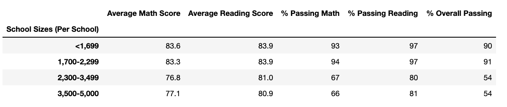
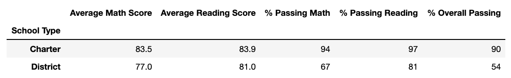

# School District Analysis

The purpose of this analysis is to look into all of the schools in a particular district and understand the relationships in math and reading testing scores to school funding, school size, and school type.

## District Summary

## School Summary

## Affect on Thomas High School

## How Replacing 9th Grade Scores Affected the Following Tables:

* **Math and Reading Scores by Grade**
  * Because the scores replaced were in one grade for one school, this did not affect the overall output of this table other than Thomas High Schools output before the edit.  The scores prior to the edit were 83.6% for math and 83.7% for reading in the 9th grade.  Post edit, Thomas High School was null for 9th grade.
* **Scores by School Spending**
  * The average test scores for for schools in the $630 to $644 range dropped off after Thomas High School had its 9th graders removed.  Furthermore, in the breakdown below you can see the drop in % for each category.  
  * % Passing Math decreased from 83% to 67%
  * % Passing reading decreased from 94% to 80%
  * % Passing Overall decreased from 72% to 53%
* **Scores by School Size**
  * There were two notable changes to the school size table.  All scores remained the same except for the % passing in all categories for schools under 1,700 students.  The scores changed from 103% passing math, 106% passing reading, and 99% passing overall to 93%, 97%, and 90% respectively.  
  
**Before Thomas High School Edit**

**Before Thomas High School Edit**

* **Scores by School Type**
  * Since Thomas High School is a charter school, the numbers in the passing percentages varied here as well.  
  
**Before Thomas High School Edit**
  

  
**After Thomas High Shcool Edit**
  

